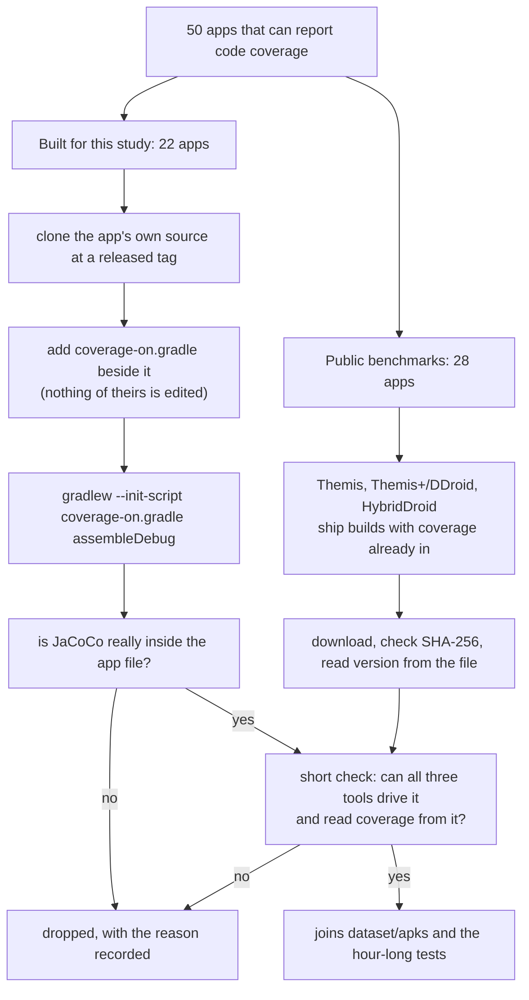

# Dataset: 50 Android apps that can report code coverage

Every app here was driven for an hour by all three tools and reported code
coverage while it ran. Each row below links to the app file in this repository,
and gives the version the app reports about itself, its install name, the Android
levels it was built for, its SHA-256, and exactly where it came from.

*Snapshot 2026-08-30 20:20 UTC, repository at `43365b83a`.*

## What is in the set

| | |
|---|---:|
| Apps | 50 |
| Public benchmark apps | 28 |
| Apps built for this study, from each app's own source | 22 |
| Total size of the app files | 1.17 GB |
| Tests run on them | 150 (3 tools × 50 apps) |

Every app file is in **[`dataset/apks/`](dataset/apks/)**, one folder, one file per
app. The machine-readable table is **[`dataset/apps.tsv`](dataset/apps.tsv)** and
**[`dataset/apps.json`](dataset/apps.json)**; the JSON carries the build details too.

Versions in this document are read from each app file with `aapt dump badging`,
not from its file name. Benchmark file names are not always accurate about the
version they contain, and a paper cannot rest on a file name.

## Why an app has to be built a certain way

Code coverage is read from the app itself. JaCoCo has to be compiled into the
app, and the app then hands its counts over a local socket, which the harness
reads every 30 seconds. Two things follow, and both cost apps:

1. **A normal store or F-Droid build cannot be used.** It has no coverage library
   inside it, and nothing can add one afterwards without rebuilding the app.
2. **The app must declare `android.permission.INTERNET`.** Without it Android
   refuses the socket, so the coverage counts can never be read, whichever tool
   drives the app. Four apps were dropped for exactly this reason.

That is the whole reason this set is only 50 apps, and why it took
two routes to fill.

## Public benchmark apps (28)

These benchmarks publish app files already built with coverage switched on, for
research on Android testing.

| Benchmark | Apps | Source |
|---|---:|---|
| Themis | 17 | [the-themis-benchmarks/home](https://github.com/the-themis-benchmarks/home) |
| HybridDroid | 10 | [hybd123/HybridDroid](https://github.com/hybd123/HybridDroid) |
| Themis+ / DDroid | 1 | [DDroid-Android/home](https://github.com/DDroid-Android/home) |

| App | Version | Install name | Min / target SDK | Size | SHA-256 (first 12) | Benchmark, and its own files here |
|---|---|---|---|---:|---|---|
| [A Photo Manager](dataset/apks/A-Photo-Manager.apk) | 0.6.4.180314 (36) | `de.k3b.android.androFotoFinder` | 14 / 21 | 2.8 MB | `59449bf71602` | [Themis](https://github.com/the-themis-benchmarks/home)<br/>[benchmark files](reproduction/datasets/public-benchmarks/themis-jacoco/APhotoManager) |
| [Amaze](dataset/apks/Amaze.apk) | 3.2.1 (63) | `com.amaze.filemanager` | 14 / 25 | 6.4 MB | `78051077bc5a` | [Themis](https://github.com/the-themis-benchmarks/home)<br/>[benchmark files](reproduction/datasets/public-benchmarks/themis-jacoco/AmazeFileManager) |
| [And Bible](dataset/apks/And-Bible.apk) | 3.2.327 (327) | `net.bible.android.activity` | 19 / 29 | 10.0 MB | `9b2828477cc0` | [Themis](https://github.com/the-themis-benchmarks/home)<br/>[benchmark files](reproduction/datasets/public-benchmarks/themis-jacoco/and-bible) |
| [AnkiDroid](dataset/apks/AnkiDroid.apk) | 2.6beta6 (20600206) | `com.ichi2.anki` | 10 / 23 | 6.2 MB | `950858fc02b4` | [Themis](https://github.com/the-themis-benchmarks/home)<br/>[benchmark files](reproduction/datasets/public-benchmarks/themis-jacoco/AnkiDroid) |
| [AntennaPod Debug](dataset/apks/AntennaPod-Debug.apk) | 3.5.0 (3050095) | `de.danoeh.antennapod.debug` | 21 / 34 | 23.3 MB | `444c115b63df` | [HybridDroid](https://github.com/hybd123/HybridDroid)<br/>[benchmark files](reproduction/datasets/public-benchmarks/hybriddroid-jacoco) |
| [Chess](dataset/apks/Chess.apk) | 9.5.0 (201) | `jwtc.android.chess` | 21 / 34 | 7.9 MB | `9696eff8b634` | [HybridDroid](https://github.com/hybd123/HybridDroid)<br/>[benchmark files](reproduction/datasets/public-benchmarks/hybriddroid-jacoco) |
| [Commons](dataset/apks/Commons.apk) | 2.7.1-debug-HEAD~c6b74e72f (84) | `fr.free.nrw.commons.debug` | 15 / 25 | 22.8 MB | `d2010417075b` | [Themis](https://github.com/the-themis-benchmarks/home)<br/>[benchmark files](reproduction/datasets/public-benchmarks/themis-jacoco/commons) |
| [Eventyay Attendee](dataset/apks/Eventyay-Attendee.apk) | 0.5.0 (11) | `com.eventyay.attendee` | 21 / 28 | 12.9 MB | `b4892f7c098c` | [Themis](https://github.com/the-themis-benchmarks/home)<br/>[benchmark files](reproduction/datasets/public-benchmarks/themis-jacoco/open-event-attendee-android) |
| [FeederD](dataset/apks/FeederD.apk) | 2.6.33 (318) | `com.nononsenseapps.feeder.debug` | 23 / 35 | 64.0 MB | `92575b9bb1dd` | [HybridDroid](https://github.com/hybd123/HybridDroid)<br/>[benchmark files](reproduction/datasets/public-benchmarks/hybriddroid-jacoco) |
| [Firefox Lite Dev](dataset/apks/Firefox-Lite-Dev.apk) | 2.1.20.debug.ting (1) | `org.mozilla.rocket.debug.ting` | 21 / 28 | 17.2 MB | `68b5f20f0259` | [Themis](https://github.com/the-themis-benchmarks/home)<br/>[benchmark files](reproduction/datasets/public-benchmarks/themis-jacoco/FirefoxLite) |
| [Frost Debug](dataset/apks/Frost-Debug.apk) | 2.2.1-debug (2020100) | `com.pitchedapps.frost.debug` | 21 / 28 | 11.0 MB | `c2445ddf612f` | [Themis](https://github.com/the-themis-benchmarks/home)<br/>[benchmark files](reproduction/datasets/public-benchmarks/themis-jacoco/Frost) |
| [Geohash Droid](dataset/apks/Geohash-Droid.apk) | 0.9.4 (925) | `net.exclaimindustries.geohashdroid` | 16 / 29 | 3.9 MB | `187c19093ac1` | [Themis](https://github.com/the-themis-benchmarks/home)<br/>[benchmark files](reproduction/datasets/public-benchmarks/themis-jacoco/geohashdroid) |
| [MaterialFBook](dataset/apks/MaterialFBook.apk) | 4.0.2 (74) | `me.zeeroooo.materialfb` | 17 / 29 | 4.1 MB | `52d0cb4c74ee` | [Themis](https://github.com/the-themis-benchmarks/home)<br/>[benchmark files](reproduction/datasets/public-benchmarks/themis-jacoco/MaterialFBook) |
| [My Expenses Debug](dataset/apks/My-Expenses-Debug.apk) | 3.9.3 (774) | `org.totschnig.myexpenses.debug` | 21 / 34 | 57.5 MB | `e0574b73a452` | [HybridDroid](https://github.com/hybd123/HybridDroid)<br/>[benchmark files](reproduction/datasets/public-benchmarks/hybriddroid-jacoco) |
| [NewPipe Debug](dataset/apks/NewPipe-Debug.apk) | 0.27.2 (999) | `org.schabi.newpipe.debug` | 21 / 33 | 23.8 MB | `b0636dba8ac3` | [HybridDroid](https://github.com/hybd123/HybridDroid)<br/>[benchmark files](reproduction/datasets/public-benchmarks/hybriddroid-jacoco) |
| [Nextcloud](dataset/apks/Nextcloud.apk) | 3.9.0 RC1 (30090051) | `com.nextcloud.client` | 14 / 28 | 18.2 MB | `373782edfd34` | [Themis](https://github.com/the-themis-benchmarks/home)<br/>[benchmark files](reproduction/datasets/public-benchmarks/themis-jacoco/nextcloud) |
| [ODK Collect](dataset/apks/ODK-Collect.apk) | v1.23.0-beta.2-dirty (3857) | `org.odk.collect.android` | 16 / 26 | 15.7 MB | `7943e8bbfb36` | [Themis](https://github.com/the-themis-benchmarks/home)<br/>[benchmark files](reproduction/datasets/public-benchmarks/themis-jacoco/collect) |
| [Omni Notes Alpha](dataset/apks/Omni-Notes-Alpha.apk) | 6.4.0 (333) | `it.feio.android.omninotes.alpha` | 24 / 33 | 17.4 MB | `0d3c81593797` | [HybridDroid](https://github.com/hybd123/HybridDroid)<br/>[benchmark files](reproduction/datasets/public-benchmarks/hybriddroid-jacoco) |
| [OpenLauncher](dataset/apks/OpenLauncher.apk) | 0.3.1 (9) | `com.benny.openlauncher` | 16 / 25 | 4.0 MB | `dd585b663ea2` | [Themis](https://github.com/the-themis-benchmarks/home)<br/>[benchmark files](reproduction/datasets/public-benchmarks/themis-jacoco/openlauncher) |
| [OwnTracks](dataset/apks/OwnTracks.apk) | 2.5.3 (420503000) | `org.owntracks.android.debug` | 24 / 34 | 29.4 MB | `b619bae9d430` | [HybridDroid](https://github.com/hybd123/HybridDroid)<br/>[benchmark files](reproduction/datasets/public-benchmarks/hybriddroid-jacoco) |
| [Phonograph DEBUG](dataset/apks/Phonograph-DEBUG.apk) | 0.15.0 BETA 1 DEBUG (130) | `com.kabouzeid.gramophone.debug` | 16 / 25 | 5.6 MB | `36f7ce9b02c4` | [Themis](https://github.com/the-themis-benchmarks/home)<br/>[benchmark files](reproduction/datasets/public-benchmarks/themis-jacoco/Phonograph) |
| [RedReader](dataset/apks/RedReader.apk) | 1.24.1 (114) | `org.quantumbadger.redreader` | 21 / 34 | 29.2 MB | `3c11a55e65e9` | [HybridDroid](https://github.com/hybd123/HybridDroid)<br/>[benchmark files](reproduction/datasets/public-benchmarks/hybriddroid-jacoco) |
| [Scarlet Notes FD](dataset/apks/Scarlet-Notes-FD.apk) | 6.9.5-pro (123) | `com.bijoysingh.quicknote.pro` | 17 / 28 | 9.9 MB | `c65031a6a644` | [Themis+ / DDroid](https://github.com/DDroid-Android/home)<br/>[benchmark files](reproduction/datasets/public-benchmarks/ddroid-jacoco/Scarlet-Notes) |
| [Simple Alarm Clock](dataset/apks/Simple-Alarm-Clock.apk) | 3.16.01 (31601) | `com.better.alarm.debug` | 21 / 33 | 12.2 MB | `f68b268b3313` | [HybridDroid](https://github.com/hybd123/HybridDroid)<br/>[benchmark files](reproduction/datasets/public-benchmarks/hybriddroid-jacoco) |
| [Sunflower](dataset/apks/Sunflower.apk) | 0.1.6 (1) | `com.google.samples.apps.sunflower` | 19 / 28 | 4.1 MB | `0108e79ec186` | [Themis](https://github.com/the-themis-benchmarks/home)<br/>[benchmark files](reproduction/datasets/public-benchmarks/themis-jacoco/sunflower) |
| [Vespucci](dataset/apks/Vespucci.apk) | 11.0.0.8 (604) | `de.blau.android` | 9 / 25 | 13.6 MB | `d8bb98555c0a` | [Themis](https://github.com/the-themis-benchmarks/home)<br/>[benchmark files](reproduction/datasets/public-benchmarks/themis-jacoco/osmeditor4android) |
| [Wikipedia Alpha](dataset/apks/Wikipedia-Alpha.apk) | 2.7.50507-alpha-2024-10-25 (50507) | `org.wikipedia.alpha` | 21 / 34 | 47.2 MB | `5882b3f0a226` | [HybridDroid](https://github.com/hybd123/HybridDroid)<br/>[benchmark files](reproduction/datasets/public-benchmarks/hybriddroid-jacoco) |
| [WordPress](dataset/apks/WordPress.apk) | 9.2 (520) | `org.wordpress.android` | 16 / 25 | 15.0 MB | `cdeda01a549f` | [Themis](https://github.com/the-themis-benchmarks/home)<br/>[benchmark files](reproduction/datasets/public-benchmarks/themis-jacoco/WordPress) |

The `Benchmark file` column is the path the file has inside
`reproduction/datasets/`, kept because the benchmark's own naming carries its
issue or build number and identifies the file inside that benchmark.

## Apps built for this study (22)

No public benchmark ships more apps with coverage built in, so the rest were
built from each app's own source, at a released tag, with coverage switched on.

| App | Version | Install name | Min / target SDK | Size | SHA-256 (first 12) | Source, at the exact commit |
|---|---|---|---|---:|---|---|
| [Binary Eye](dataset/apks/Binary-Eye.apk) | 1.63.12 (140) | `de.markusfisch.android.binaryeye.debug` | 9 / 34 | 8.9 MB | `ff95b88bb4c2` | [markusfisch/BinaryEye](https://github.com/markusfisch/BinaryEye) at tag `1.63.12`<br/>[commit `bf5dc96ac962`](https://github.com/markusfisch/BinaryEye/tree/bf5dc96ac9621a3ab0f395a580f3509d3f823444) |
| [Breezy Weather](dataset/apks/Breezy-Weather.apk) | 5.2.8-r1 (50208) | `org.breezyweather.debug` | 21 / 34 | 43.0 MB | `41fbae1b98ba` | [breezy-weather/breezy-weather](https://github.com/breezy-weather/breezy-weather) at tag `v5.2.8`<br/>[commit `7fcc13ce2a2b`](https://github.com/breezy-weather/breezy-weather/tree/7fcc13ce2a2b828097e1bca202ce91a6453ffbca) |
| [Fedilab](dataset/apks/Fedilab.apk) | 3.28.0 (513) | `app.fedilab.android.debug` | 21 / 34 | 45.1 MB | `24fd15d727d7` | [stom79/Fedilab](https://github.com/stom79/Fedilab) at tag `3.28.0`<br/>[commit `c44330d291ad`](https://github.com/stom79/Fedilab/tree/c44330d291ad37b5a5136f876cc791869a67695e) |
| [GPSLogger](dataset/apks/GPSLogger.apk) | 131-rc2 (131) | `com.mendhak.gpslogger` | 16 / 30 | 8.0 MB | `dc74dc27904d` | [mendhak/gpslogger](https://github.com/mendhak/gpslogger) at tag `v131`<br/>[commit `67fa9918631b`](https://github.com/mendhak/gpslogger/tree/67fa9918631b9584aa9113fe46b8b1dca7b4eb5a) |
| [Infinity For Reddit](dataset/apks/Infinity-For-Reddit.apk) | 7.3.4 (DEBUG) (183) | `ml.docilealligator.infinityforreddit.debug` | 21 / 34 | 24.0 MB | `255fcf26a642` | [Docile-Alligator/Infinity-For-Reddit](https://github.com/Docile-Alligator/Infinity-For-Reddit) at tag `v7.3.4`<br/>[commit `b703463fb740`](https://github.com/Docile-Alligator/Infinity-For-Reddit/tree/b703463fb740b7a4e6c74c4c599defadf19a5f3e) |
| [Jellyfin Android](dataset/apks/Jellyfin-Android.apk) | 0.0.0-dev.1 (1) | `org.jellyfin.mobile.debug` | 21 / 34 | 53.0 MB | `77406fbae801` | [jellyfin/jellyfin-android](https://github.com/jellyfin/jellyfin-android) at tag `v2.6.2`<br/>[commit `8908d18f585a`](https://github.com/jellyfin/jellyfin-android/tree/8908d18f585af19bd9d30347721f39a489616ab0) |
| [Kiwix](dataset/apks/Kiwix.apk) | 3.11.1 (7231101) | `org.kiwix.kiwixmobile` | 25 / 33 | 108.3 MB | `154e7b9ee18a` | [kiwix/kiwix-android](https://github.com/kiwix/kiwix-android) at tag `3.11.1`<br/>[commit `9c4ae35c42a5`](https://github.com/kiwix/kiwix-android/tree/9c4ae35c42a5e599fcf3ba84978742fcaec1a86b) |
| [Kore](dataset/apks/Kore.apk) | v3.1.0 (33) | `org.xbmc.kore` | 24 / 34 | 13.6 MB | `ca4ddcc7287c` | [xbmc/Kore](https://github.com/xbmc/Kore) at tag `v3.1.0`<br/>[commit `5f711140d7e9`](https://github.com/xbmc/Kore/tree/5f711140d7e9593f4b8048f0c613288b54e17302) |
| [LibreTorrent](dataset/apks/LibreTorrent.apk) | 3.5.2-DEBUG (9000290) | `org.proninyaroslav.libretorrent.debug` | 24 / 34 | 68.3 MB | `5ae71edadf68` | [proninyaroslav/libretorrent](https://github.com/proninyaroslav/libretorrent) at tag `3.5.2`<br/>[commit `d93e92eacebc`](https://github.com/proninyaroslav/libretorrent/tree/d93e92eacebc46146cc9f16d62b3ea8a3438df87) |
| [Money Manager Ex](dataset/apks/Money-Manager-Ex.apk) | 2024.09.21 (1041) | `com.money.manager.ex` | 26 / 31 | 35.4 MB | `ee8f761a6303` | [moneymanagerex/android-money-manager-ex](https://github.com/moneymanagerex/android-money-manager-ex) at tag `2024.09.21.1041`<br/>[commit `b20078373d96`](https://github.com/moneymanagerex/android-money-manager-ex/tree/b20078373d96df1cda62861451b8a42312e7dd88) |
| [Muzei](dataset/apks/Muzei.apk) | 3.6.2 Debug (360005) | `net.nurik.roman.muzei` | 21 / 34 | 18.4 MB | `edc484d086b2` | [muzei/muzei](https://github.com/muzei/muzei) at tag `v3.6.2`<br/>[commit `82f4a194fe34`](https://github.com/muzei/muzei/tree/82f4a194fe34572e4a3fa4670d64560f15d99bb3) |
| [Open Food Facts](dataset/apks/Open-Food-Facts.apk) | 3.9.0 (582) | `org.openpetfoodfacts.scanner.debug` | 21 / 33 | 32.2 MB | `c5d3547d1878` | [openfoodfacts/openfoodfacts-androidapp](https://github.com/openfoodfacts/openfoodfacts-androidapp) at tag `v3.10.2`<br/>[commit `b811f0a3c8f1`](https://github.com/openfoodfacts/openfoodfacts-androidapp/tree/b811f0a3c8f1423b1d6923d566f46bd524a55903) |
| [Orgzly Revived](dataset/apks/Orgzly-Revived.apk) | 1.8.27-beta.2 (219) | `com.orgzlyrevived` | 21 / 33 | 19.4 MB | `0d95d9d1b6de` | [orgzly-revived/orgzly-android-revived](https://github.com/orgzly-revived/orgzly-android-revived) at tag `v1.8.27-beta.2`<br/>[commit `f0cccf203585`](https://github.com/orgzly-revived/orgzly-android-revived/tree/f0cccf203585cc1f08cefb5eeb935a21c48ff732) |
| [ownCloud](dataset/apks/ownCloud.apk) | 4.4.0 (44000000) | `com.owncloud.android.debug` | 24 / 34 | 21.2 MB | `bad1cb147a57` | [owncloud/android](https://github.com/owncloud/android) at tag `v4.4.0`<br/>[commit `3913582ba2d5`](https://github.com/owncloud/android/tree/3913582ba2d529782962ccabcc2e374d83909c64) |
| [SkyTube](dataset/apks/SkyTube.apk) | 2.999 (59) | `free.rm.skytube.extra` | 19 / 28 | 24.2 MB | `0f70eb86505a` | [SkyTubeTeam/SkyTube](https://github.com/SkyTubeTeam/SkyTube) at tag `v2.999`<br/>[commit `072e22916316`](https://github.com/SkyTubeTeam/SkyTube/tree/072e2291631675f2b224156440b5a1bb888df49f) |
| [StreetComplete](dataset/apks/StreetComplete.apk) | 57.3 (5705) | `de.westnordost.streetcomplete.debug` | 21 / 34 | 74.0 MB | `eeac0f53d3b4` | [streetcomplete/StreetComplete](https://github.com/streetcomplete/StreetComplete) at tag `v57.3`<br/>[commit `3a7dc5b6c905`](https://github.com/streetcomplete/StreetComplete/tree/3a7dc5b6c90597555ecd34cc1ecf6351e60fbe9f) |
| [Trackbook](dataset/apks/Trackbook.apk) | 2.1.2 (50) | `org.y20k.trackbook` | 25 / 32 | 7.7 MB | `9b716998df9b` | [y20k/trackbook](https://github.com/y20k/trackbook) at tag `v2.1.2`<br/>[commit `467918c171c2`](https://github.com/y20k/trackbook/tree/467918c171c20d1318cc4a2564e497947fd52978) |
| [Transistor](dataset/apks/Transistor.apk) | 4.1.1 (91) | `org.y20k.transistor` | 25 / 32 | 11.4 MB | `4e18fd859c30` | [y20k/transistor](https://github.com/y20k/transistor) at tag `v4.1.1`<br/>[commit `54dff41feb56`](https://github.com/y20k/transistor/tree/54dff41feb56a53b9469110c8cad34b28a438306) |
| [Twire](dataset/apks/Twire.apk) | 2.11.0-DEBUG (534) | `com.perflyst.twire.debug` | 21 / 34 | 13.9 MB | `a365c9a84117` | [twireapp/Twire](https://github.com/twireapp/Twire) at tag `v2.11.0`<br/>[commit `43572429e82b`](https://github.com/twireapp/Twire/tree/43572429e82bab7fa3f7de0bbbb2990dd2874b85) |
| [Ultrasonic](dataset/apks/Ultrasonic.apk) | 3.2.0 (103) | `org.moire.ultrasonic.debug` | 21 / 30 | 12.4 MB | `ff8d14e005b6` | [ultrasonic/ultrasonic](https://github.com/ultrasonic/ultrasonic) at tag `4.0.0-beta.1`<br/>[commit `139e81018640`](https://github.com/ultrasonic/ultrasonic/tree/139e81018640c65bec7376f86cfba59c260318c7) |
| [Vinyl Music Player](dataset/apks/Vinyl-Music-Player.apk) | 1.11.0-HEAD_d8aeb8c_260816-1554 CI DEBUG (202) | `com.poupa.vinylmusicplayer.ci.debug` | 19 / 33 | 13.8 MB | `ca13498a51d2` | [AdrienPoupa/VinylMusicPlayer](https://github.com/AdrienPoupa/VinylMusicPlayer) at tag `1.11.0`<br/>[commit `d8aeb8c65f99`](https://github.com/AdrienPoupa/VinylMusicPlayer/tree/d8aeb8c65f997f33e857d5ca5bbb9ac049ab40a1) |
| [Wallabag](dataset/apks/Wallabag.apk) | 2.5.3-DEBUG (233) | `fr.gaulupeau.apps.InThePoche.debug` | 21 / 34 | 16.3 MB | `c9b5927f6be4` | [wallabag/android-app](https://github.com/wallabag/android-app) at tag `2.5.3`<br/>[commit `277ddaa3b2cb`](https://github.com/wallabag/android-app/tree/277ddaa3b2cb70e4687e9af1e08d095fc82015eb) |

### How each app was built, exactly

**The file that makes it possible:**
[`reproduction/build/coverage-on.gradle`](reproduction/build/coverage-on.gradle).
That is the whole mechanism, and it is 40 lines. **The script that does the
building:**
[`reproduction/runner/build_jacoco_apks.py`](reproduction/runner/build_jacoco_apks.py),
which reads its candidates from
[`app_recipes.tsv`](reproduction/runner/app_recipes.tsv).

The app's own source is used as published and **no file of theirs is edited**. The
one file added is placed *beside* the checkout and handed to Gradle as an init
script. An init script runs alongside a build without belonging to it, which is
why the app's own build files stay exactly as their authors wrote them:

```bash
git clone --depth 1 --recurse-submodules --branch <tag> <repo> src/<app>
cp reproduction/build/coverage-on.gradle src/<app>/
cd src/<app>
./gradlew --no-daemon --max-workers=1 --init-script coverage-on.gradle \
    -Pandroid.aapt2FromMavenOverride=/usr/bin/aapt2 <module>:assembleDebug
```

Then, before the app is allowed anywhere near a test:

1. **open the built app and look for JaCoCo inside it.** A `.dex` entry has to
   contain the coverage library, or the build is recorded as failed however well
   Gradle went;
2. **read the app's install name and version from the file itself**, and reject it
   if an app already in the set installs under the same name;
3. **record its SHA-256**, size, repository, tag and commit;
4. **delete the source copy.** The app file and that record are what is kept; the
   15 GB of checkouts are not.

What `coverage-on.gradle` changes, and nothing else:

| It does | Why |
|---|---|
| sets `enableAndroidTestCoverage` and `testCoverageEnabled` on the **debug** build type | this is what compiles JaCoCo into the app, and it is the only way coverage can be read from it later |
| holds `compileSdk` at 34, for application **and** library modules | the resource and interface compilers available for this machine's processor cannot read Android 35 or newer; holding it for the app module alone left library modules on 35 and 14 builds failed there |

Both property names are set because the name changed between Android Gradle Plugin
versions, and each is wrapped so a project that has neither is left alone. No
source, no manifest, no dependency and no version of any app is touched.

Three other build settings are passed on the command line, and they are about this
machine rather than about the app: an ARM64 resource compiler, a Java version the
app's own Gradle can work with (Java 11 for Gradle older than 7, Java 17
otherwise), and a 3 GB heap, because 1 GB was not enough to merge dex files and 30
builds died there.

`git status` in each checkout showed no modified file, and nothing was pushed back
to any of these projects.



### Where an app's own version differs from the tag it was built at

For most apps the version inside the app file matches the tag it was built from. For these it does not, so both are given. **The identifiers to rely on are the commit and the SHA-256**, which are exact either way.

| App | Version in the app file | Built from tag | Commit | Install name |
|---|---|---|---|---|
| GPSLogger | 131-rc2 | `v131` | `67fa9918631b` | `com.mendhak.gpslogger` |
| Jellyfin Android | 0.0.0-dev.1 | `v2.6.2` | `8908d18f585a` | `org.jellyfin.mobile.debug` |
| Open Food Facts | 3.9.0 | `v3.10.2` | `b811f0a3c8f1` | `org.openpetfoodfacts.scanner.debug` |
| Ultrasonic | 3.2.0 | `4.0.0-beta.1` | `139e81018640` | `org.moire.ultrasonic.debug` |

Three reasons account for these. A project can set its version from release tooling that was not run here, so the app reports a placeholder. A project can carry a pre-release version in the tree at the tag, so the app says `131-rc2` where the tag says `v131`. And a project can build several products from one source, in which case the install name says which one was actually tested.

That last case matters here: **Open Food Facts was built as its pet-food product**, `org.openpetfoodfacts.scanner.debug`, which is the same codebase and a different app. It is reported under that install name throughout, and it should not be read as a test of the Open Food Facts product.

### What the build attempts cost

| Outcome | Count |
|---|---:|
| Built with coverage inside | 32 |
| Failed | 69 |

The failures, by the reason recorded:

| Reason | Count |
|---|---:|
| gradle exited 1 | 52 |
| clone failed | 8 |
| no gradle wrapper | 7 |
| gradle exited 143 | 1 |
| built, but the coverage library is not in the app file | 1 |

Most failures are not fixable from here: the app needs a dependency no repository
serves any more, or a toolchain this machine does not have. Three patterns were
fixable and were fixed part way through, which is why later attempts did better:
the Gradle heap was too small for merging dex files, library modules were still
compiling against a platform this machine cannot read, and old Gradle versions
were being handed Java 17 instead of Java 11.

## Apps tried and left out

Leaving an app out changes what the averages mean, so each one is named with its
reason. Their app files and the evidence from their checks are kept.

| App | Install name | Why it is left out |
|---|---|---|
| Aegis | `com.beemdevelopment.aegis.debug` | Cannot report coverage at all: the app does not declare android.permission.INTERNET, and the coverage agent hands its counts over a local socket, which Android denies without that permission. Checked with every tool for 15 minutes each: the tools drove the app and the dump still failed. Nothing in the tools or the app was changed to work around it. |
| Catima | `me.hackerchick.catima.debug` | Cannot report coverage at all: the app does not declare android.permission.INTERNET, and the coverage agent hands its counts over a local socket, which Android denies without that permission. Checked with every tool for 15 minutes each: the tools drove the app and the dump still failed. Nothing in the tools or the app was changed to work around it. |
| WiFiAnalyzer | `com.vrem.wifianalyzer.debug` | Cannot report coverage at all: the app does not declare android.permission.INTERNET, and the coverage agent hands its counts over a local socket, which Android denies without that permission. Checked with every tool for 15 minutes each: the tools drove the app and the dump still failed. Nothing in the tools or the app was changed to work around it. |
| Unlauncher | `com.jkuester.unlauncher` | Cannot report coverage at all: the app does not declare android.permission.INTERNET, which the coverage agent's socket needs, so no tool can read coverage from it. Read from the app's manifest, so no test time was spent on it. |
| KISS Launcher | `fr.neamar.kiss.debug` | Cannot report coverage at all: the app does not declare android.permission.INTERNET, which the coverage agent's socket needs, so no tool can read coverage from it. Read from the app's manifest, so no test time was spent on it. |
| Photok | `dev.leonlatsch.photok.debug` | Cannot report coverage at all: the app does not declare android.permission.INTERNET, which the coverage agent's socket needs. Read from the app's manifest, so no test time was spent on it. |

## How an app earns its place

Before any hour-long test, an app is driven by **all three tools** in a short
check, and it joins the set only if each tool installs it, takes actions, and the
harness can read coverage from it. That gate is what keeps a tool from being
compared on an app that only one of them can drive.

The check evidence is under `reproduction/results/three-tool-checks/`, one folder per app
and tool, with the same files as a full test.

## Checking a copy is what was tested

```bash
# every app file against the recorded checksum
cd dataset/apks && sha256sum -c <(awk -F'\t' 'NR==1 {for (i=1; i<=NF; i++) col[$i]=i; next}
                {print $col["sha256"] "  " $col["apk_file"]}' ../apps.tsv)
```

It reads the column positions from the header, so it keeps working if columns
are added, and verifies all 50 files in one go.
